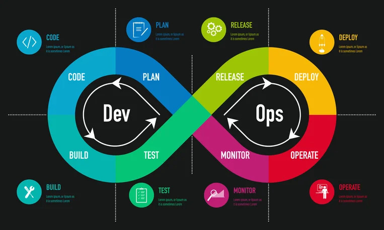

#[DevOps](https://www.netapp.com/es/devops-solutions/what-is-devops/)

Metodología que combina desarrollo (Dev) y operaciones (Ops) para mejorar la automatización y entrega continua de software. Usa herramientas como:

- Docker (contenedores).
- Kubernetes (orquestación de contenedores).
- Jenkins/GitLab CI (integración y despliegue continuo).

