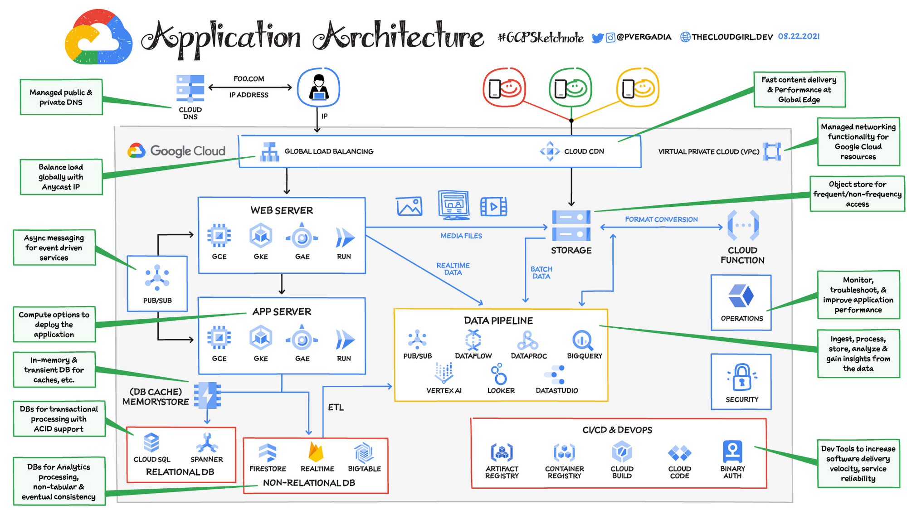

# [Google Cloud](https://datademia.es/blog/que-es-google-cloud-platform)

Plataforma de computación en la nube de Google con servicios como Compute Engine (VMs), Cloud Storage, BigQuery (análisis de datos).

