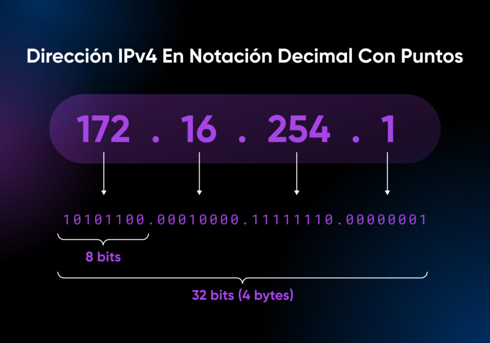

# [IP (Internet Protocol)](https://www.avg.com/es/signal/what-is-an-ip-address)

Es un identificador único asignado a un dispositivo dentro de una red, permitiendo la comunicación entre equipos. Puede ser de dos tipos:

IPv4: Formato de 32 bits (ejemplo: 192.168.1.1).

IPv6: Formato de 128 bits (ejemplo: 2001:0db8:85a3:0000:0000:8a2e:0370:7334).

