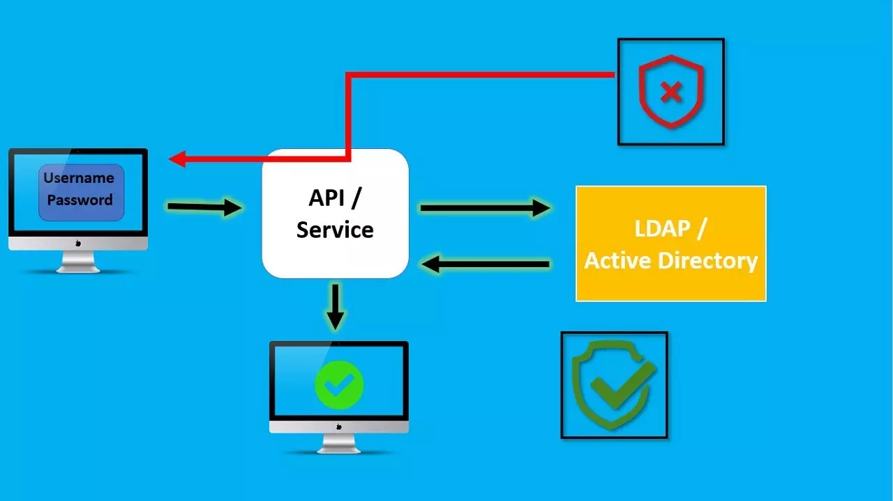

# [OpenLDAP](https://www.redeszone.net/tutoriales/servidores/que-es-ldap-funcionamiento/)

Es una implementación de código abierto del protocolo LDAP (Lightweight Directory Access Protocol) que permite autenticar y gestionar usuarios en redes.

