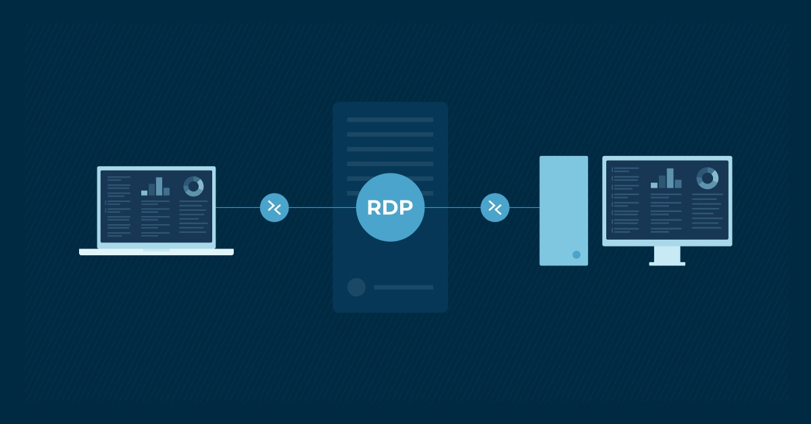

# [RDP (Remote Desktop Protocol)](https://www.cloudflare.com/es-es/learning/access-management/what-is-the-remote-desktop-protocol/)

Protocolo de Microsoft para acceder gráficamente a escritorios remotos a través del puerto 3389.

